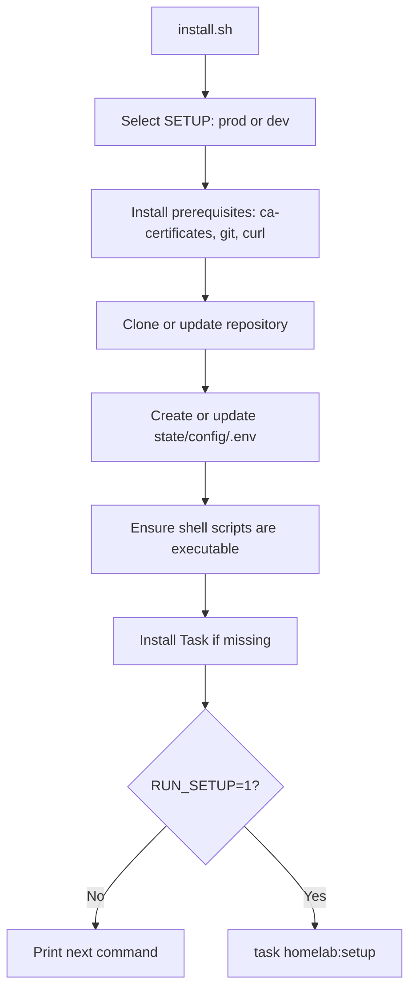

# HomeLab Execution Flow

This document describes the standard setup execution flow from `install.sh` through `task homelab:setup`.

## Installer flow

## Standard setup flow

```mermaid
flowchart TD
  A[task homelab:setup] --> B[homelab:bootstrap]
  B --> B1[Banner and script permissions]
  B1 --> B2[Code-server helper install]
  B2 --> B3[Passwords and SOPS setup]
  B3 --> B4[Git and GitHub setup]
  B4 --> B5[Automation tooling setup]
  B5 --> B6[Initial inventory]
  B6 --> B7[SSH tooling and key creation]

  B7 --> C[homelab:configure]
  C --> C1[Proxmox host configuration]
  C1 --> C2[Proxmox API role, user, ACL, token]

  C2 --> D[homelab:provision]
  D --> D1[Terraform init]
  D1 --> D2[Terraform plan]
  D2 --> D3[Terraform apply]
  D3 --> D4[Sync Terraform LXCs into inventory]
  D4 --> D5[Start Terraform-defined LXCs]

  D5 --> E[homelab:access]
  E --> E1[Wait for SSH]
  E1 --> E2[Copy SSH key]
  E2 --> E3[Normalise key-based auth]
  E3 --> E4[Verify SSH access]

  E4 --> F[homelab:configure-services]
  F --> F1[Configure Plex with Ansible]

  F1 --> G[homelab:validate]
  G --> G1[Ansible ping]
  G1 --> G2[Write setup marker]
  G2 --> G3[Health and capability reports]
```

## Phase tasks

| Phase | Task | Purpose |
| --- | --- | --- |
| Bootstrap | `task homelab:bootstrap` | Local control-plane readiness: secrets, GitHub, tooling, inventory, SSH key. |
| Configure | `task homelab:configure` | Proxmox host metadata and API automation account. |
| Provision | `task homelab:provision` | Terraform lifecycle and LXC start. |
| Access | `task homelab:access` | SSH bootstrap after hosts exist. |
| Services | `task homelab:configure-services` | Service configuration after access is confirmed. |
| Validate | `task homelab:validate` | Connectivity, health checks, capability report, setup marker. |

## Safety notes

- SSH bootstrap runs only after Terraform apply and LXC start, avoiding failures against hosts that do not yet exist.
- `NONINTERACTIVE=1` now fails fast when required values are missing instead of blocking on prompts.
- GitHub token plaintext fallback is disabled by default. Use encrypted SOPS storage, or explicitly set `ALLOW_PLAINTEXT_TOKEN=1` for a temporary local fallback.
- Community Script downloads are pinned by URL and can be checksum-verified with `script_sha256`.
- The code-server helper no longer sources remote telemetry code at runtime and supports optional Debian package checksum verification through `CODE_SERVER_DEB_SHA256`.
